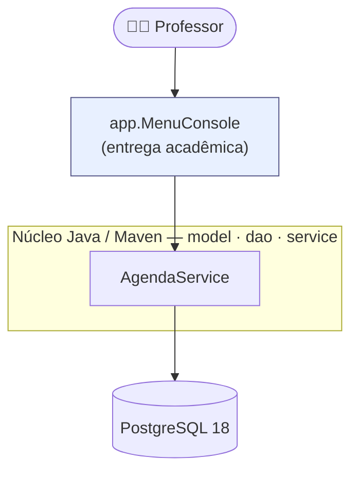

> [!tip] O que é este projeto
> Sistema de **cadastro de contatos do TJGO** (unidades prisionais, órgãos e as pessoas ligadas a eles), em uma aplicação **console Java + PostgreSQL**:
> - **Console** (Java 17 / JDBC / Maven) → entrega da disciplina **Projeto Integrador II-A** (EAD/TADS — PUC Goiás), trabalho **individual**.
>
> Segue um processo de criação de produto (validação → engenharia → design), com rigor proporcional.

> [!note] Como executar
> O passo a passo de execução em máquina limpa (instalar Postgres → criar DB → rodar dump → credenciais → `mvn` → run) está em **[console/README.md](console/README.md)**.

# Navegação

| # | Documento | Responde |
|---|-----------|----------|
| 0 | [concepcao](concepcao.md) | Problema, atores, visão, lista OUT |
| 1 | [v0.1-spec](v0.1-spec.md) | **Console**: user stories, RF/RNF, critérios de aceite, **casos de uso** |
| 2 | [v0.1-data-model](v0.1-data-model.md) | Modelo conceitual → lógico → físico, **MER**, **DER**, **DDL** (4 entidades + `lotacao` N:N) |
| 3 | [v0.1-classes](v0.1-classes.md) | **Diagrama de classes** do núcleo `model`/`dao`/`service` + console |
| 4 | [ADR-001-stack](ADR-001-stack.md) | Stack do núcleo/console (Java/JDBC/Postgres/Maven) |

# Arquitetura

# Entrega acadêmica (prazo 21/06/2026 23:30)

**Nota:** Projeto `[EPP]` = **4,0** + Vídeo `[APP]` = **3,0**.

- [ ] **Código-fonte Java** — projeto Maven, pacotes `model` / `dao` / `service` / `app`
- [ ] **Repositório GitHub público** (canal preferido do professor)
- [ ] **`schema.sql`** (DDL) + **`dump.sql`** (DDL + INSERTs realistas) — rodam de primeira em banco vazio
- [ ] **README de execução** em máquina limpa (instalar Postgres → criar DB → rodar dump → credenciais → `mvn` → run)
- [ ] **Vídeo (áudio + tela)** — CRUD completo das entidades, lotação N:N, troca/desvínculo de responsável, múltiplos telefones/e-mails, "explicando pra dev novato"

> [!warning] Requisitos não-negociáveis do professor (aulas síncronas)
> *"Pego seu sistema, rodo, e tem que dar certo. Não pode 'tem que instalar não sei o quê'"* · *"Dou F5 no script e se der erro, complicou"*. → **`dump.sql` roda de primeira**; Maven resolve o driver; README documenta cada dependência (só o PostgreSQL).

# Fases do projeto

- **Fase 1 — Escopo/Requisitos** ✅ *(estes documentos)*
- **Fase 2 — Implementação** ✅ — núcleo + console + `schema.sql`/`dump.sql` + README
- **Fase 3 — Entrega** ⏳ — repo GitHub público, teste do dump do zero, **roteiro do vídeo**
