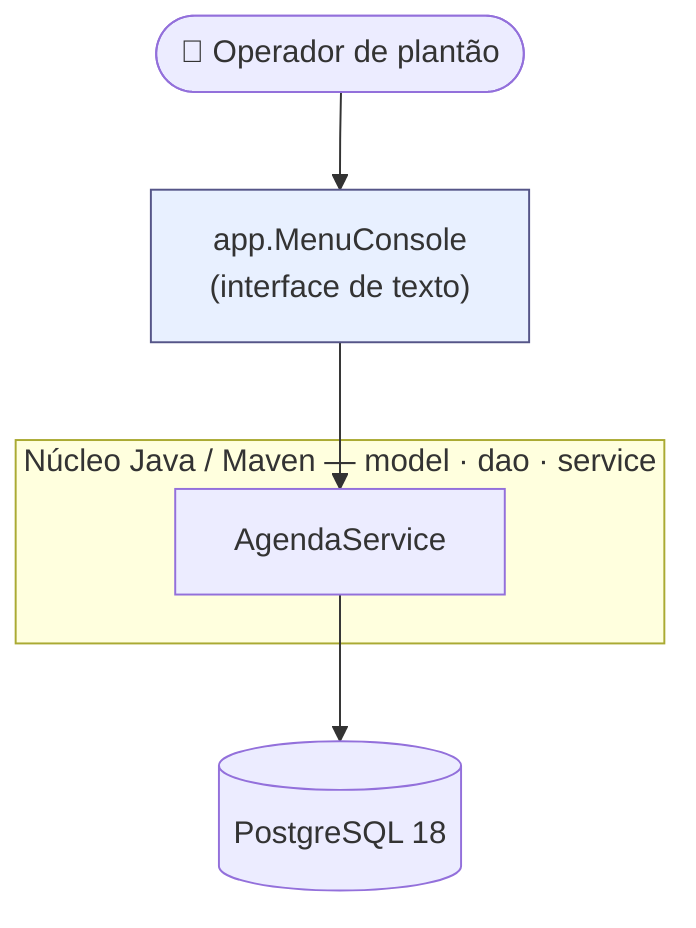

> [!tip] O que é este projeto
> Um **cadastro de contatos do TJGO** — as unidades prisionais e órgãos com que o plantão precisa falar, e as pessoas ligadas a elas. É uma aplicação de **console em Java 17 sobre PostgreSQL**, com CRUD completo, relacionamento N:N entre unidades e pessoas, e busca por nome.
>
> Esta é a versão **v0.1**: núcleo de domínio + interface de console.

> [!note] Como executar
> O passo a passo completo (instalar PostgreSQL → criar o banco → rodar o `dump.sql` → ajustar credenciais → `mvn` → run) está em **[console/README.md](console/README.md)**. Roda em máquina limpa em ~15 minutos, sem instalar nenhum `.jar` à mão.

# Documentação

| # | Documento | O que responde |
|---|-----------|----------------|
| 0 | [concepcao](concepcao.md) | Problema que resolve, quem usa, o que está dentro e fora do escopo |
| 1 | [v0.1-spec](v0.1-spec.md) | User stories, requisitos (RF/RNF), regras de negócio, critérios de aceite, casos de uso |
| 2 | [v0.1-data-model](v0.1-data-model.md) | Modelo de dados: conceitual → lógico → físico, MER, DER e o DDL completo |
| 3 | [v0.1-classes](v0.1-classes.md) | Diagrama de classes do núcleo `model` / `dao` / `service` + console |
| 4 | [ADR-001-stack](ADR-001-stack.md) | Por que Java / JDBC / PostgreSQL / Maven — a decisão de arquitetura |

# Arquitetura

A aplicação é organizada em camadas (detalhe em [v0.1-classes](v0.1-classes.md)):

- **`model`** — POJOs de domínio (Unidade, Contato, Lotacao, Telefone, Email e enums).
- **`dao`** — acesso a dados em JDBC puro, com `PreparedStatement`.
- **`service`** — regras de negócio, busca e tradução de erros, num ponto único.
- **`app`** — `MenuConsole`, o `main()` e o menu de texto.

# O que a v0.1 entrega

- **Código-fonte Java** — projeto Maven com os pacotes `model` / `dao` / `service` / `app`.
- **`schema.sql`** (DDL) e **`dump.sql`** (DDL + dados de exemplo) — rodam de primeira em banco vazio.
- **README de execução** — passo a passo testado em máquina limpa.
- **CRUD completo** de unidades, contatos, telefones e e-mails; lotação N:N; definir/trocar/remover responsável; busca por nome; tratamento de erros amigável.

# Status

- **Requisitos e modelagem** ✅ — documentos desta pasta.
- **Implementação** ✅ — núcleo + console + `schema.sql`/`dump.sql` + README.
- **Próximos passos** — possíveis evoluções (outra interface além do console, relatórios) estão fora do escopo da v0.1 (ver [concepcao](concepcao.md)).
