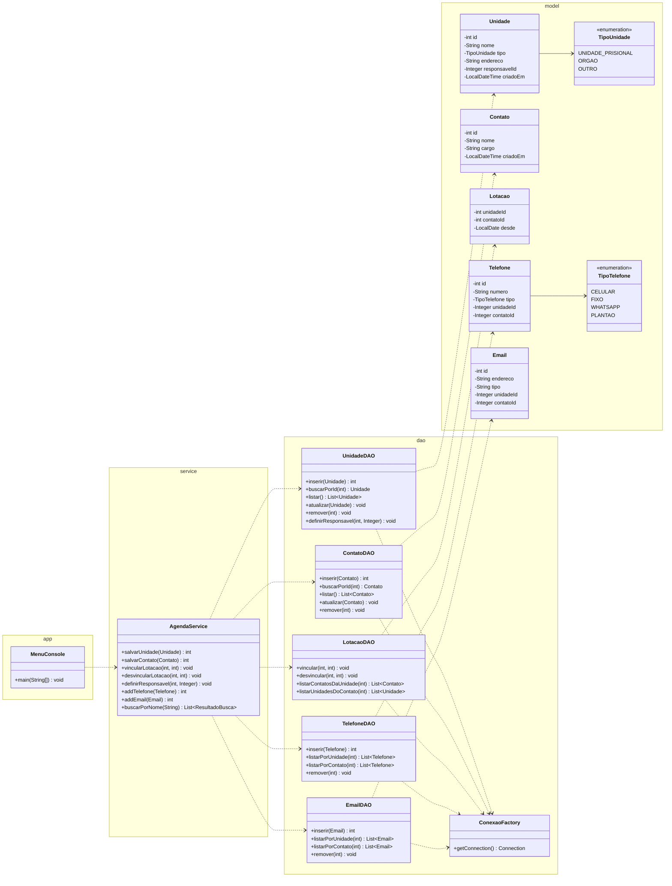

> [!info] Onde isto se encaixa
> Visão de **implementação** do **núcleo Java**. Os pacotes `model` + `dao` + `service` sustentam o console (entrega do prof). Decisões de stack em [ADR-001-stack](ADR-001-stack.md). Hub em [README](README.md).

# Organização em pacotes

| Pacote | Responsabilidade | Usado por |
|--------|------------------|-----------|
| `model` | POJOs de domínio — espelham as tabelas. Sem regra de banco. | todos |
| `dao` | **Data Access Objects** — JDBC puro com `PreparedStatement`. | service |
| `service` | Regras de negócio, orquestração de DAOs, **busca**. Ponto único de lógica. | console + API |
| `app` | `MenuConsole` (a `main`) — interação por texto. **Entrega acadêmica.** | — |

> [!tip] Por que uma camada `service`
> O console e a API REST chamam **a mesma** `service`, então a regra de negócio (validação, arco exclusivo, busca) é escrita **uma vez** e reusada nas duas faces. Sem isso, duplicaríamos lógica entre `MenuConsole` e os controllers da API.

# Diagrama de classes (núcleo + console)

# Decisões de design das classes

- **POJOs sem lógica** — `model` só carrega dados. Validação fica no banco (CHECK/FK) + na `service`.
- **Lotação como N:N** — `Contato` não tem mais `unidadeId`; o vínculo vive em `Lotacao` e é gerenciado por `LotacaoDAO` (`vincular`/`desvincular`).
- **FKs como `Integer` (wrapper)** — para representar `NULL` (responsável/dono opcionais). `int` não distingue "0" de "ausente".
- **`PreparedStatement` sempre** — contra SQL injection e para tratamento limpo de `SQLException` (RF08).
- **Tratamento de exceções** — a `service` lança exceções de domínio claras; o `MenuConsole` (e os controllers da API) as traduzem em mensagem amigável / status HTTP.
- **`numero` de telefone** — armazenado/manipulado como dígitos com DDI; formatação só na apresentação.

# Mapeamento classe ↔ tabela

| Classe (`model`) | Tabela | DAO |
|------------------|--------|-----|
| `Unidade` | `unidade` | `UnidadeDAO` |
| `Contato` | `contato` | `ContatoDAO` |
| `Lotacao` | `lotacao` | `LotacaoDAO` |
| `Telefone` | `telefone` | `TelefoneDAO` |
| `Email` | `email` | `EmailDAO` |
