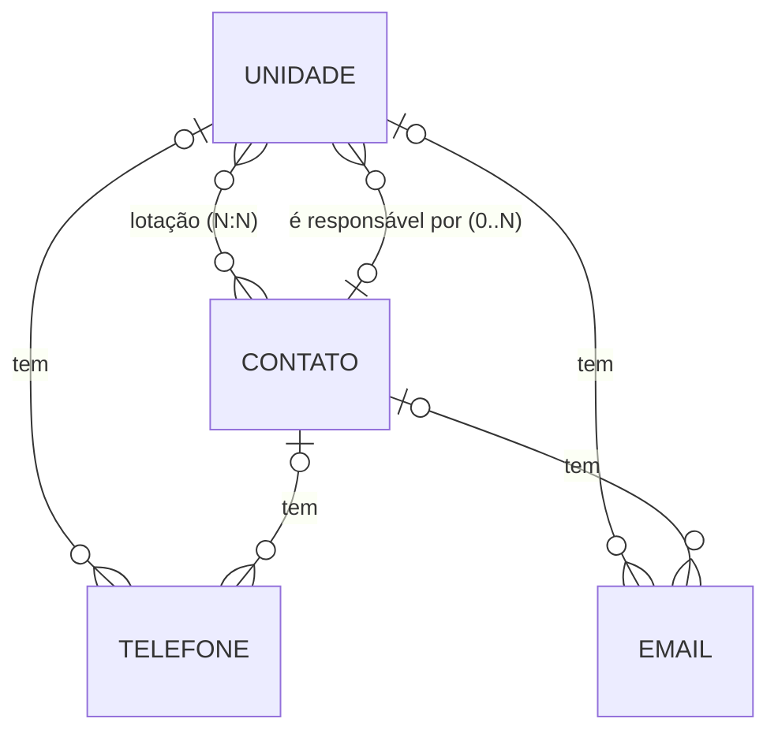
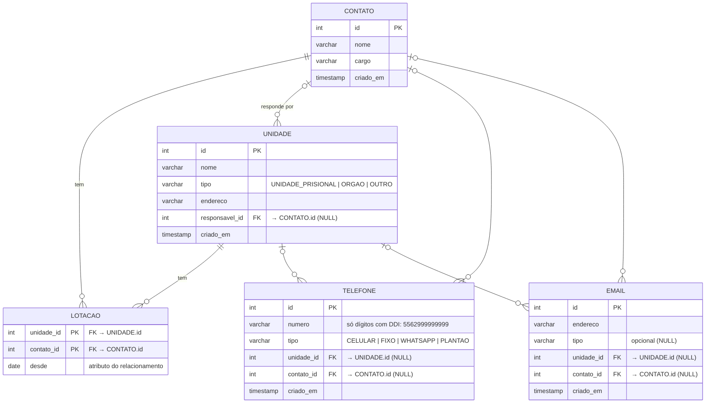

> [!info] Onde isto se encaixa
> Etapa **4.1 — Modelo de dados** (rigor máximo: é a decisão mais cara de reverter). Percorre **conceitual → lógico → físico**. Requisitos em [v0.1-spec](v0.1-spec.md). Hub em [README](README.md).

# 1. Modelo conceitual (MER)

Quatro entidades de domínio + a **associativa `lotacao`** (nasce do relacionamento N:N — exatamente o conceito que o professor destacou na aula 2, a "entidade que não existia e passou a existir no modelo lógico").



**Cardinalidades (leitura):**

| Relacionamento | Lado A | Lado B |
|----------------|--------|--------|
| **Lotação (N:N)** | uma Unidade tem **0..N** Contatos | um Contato pode estar lotado em **0..N** Unidades |
| **Responsável** | uma Unidade tem **0..1** Contato responsável | um Contato é responsável por **0..N** Unidades |
| **Telefone** | um Telefone pertence a **exatamente 1** dono | Unidade/Contato têm **0..N** Telefones |
| **E-mail** | um E-mail pertence a **exatamente 1** dono | Unidade/Contato têm **0..N** E-mails |

> [!note] Duas relações distintas entre Unidade e Contato
> **Lotação** (onde a pessoa trabalha, N:N via `lotacao`) e **responsável** (quem responde pela unidade, 0..1 via `unidade.responsavel_id`) são relações **independentes**: o responsável não precisa estar lotado na mesma unidade (RN05).

> [!note] Arco exclusivo (Telefone / E-mail)
> Telefone e E-mail ligam-se a uma Unidade **OU** a um Contato, nunca aos dois, nunca a nenhum — garantido por `CHECK`. Escolhido em vez de 4 tabelas separadas (ver [ADR-001-stack](ADR-001-stack.md)).

# 2. Modelo lógico (DER)

`lotacao` aparece como entidade própria, com PK composta e um atributo do relacionamento (`desde`).



## Política de exclusão (ON DELETE)

| FK | ON DELETE | Efeito |
|----|-----------|--------|
| `lotacao.unidade_id` | `CASCADE` | Apagar a unidade → some o vínculo de lotação (o contato sobrevive) |
| `lotacao.contato_id` | `CASCADE` | Apagar o contato → some o vínculo de lotação (a unidade sobrevive) |
| `unidade.responsavel_id` | `SET NULL` | Apagar o contato responsável → unidade fica sem responsável (RN06) |
| `telefone.*` / `email.*` | `CASCADE` | Apagar o dono → seus telefones/e-mails somem (sem órfãos) |

# 3. Modelo físico — DDL PostgreSQL 18

```sql
-- ============================================================
--  Agenda de Contatos TJGO — schema (PostgreSQL 18)
--  Ordem: unidade → contato → (ALTER FK responsável) → lotacao → telefone → email
-- ============================================================

-- 1) UNIDADE — órgão / unidade prisional / outro ponto de contato.
--    FK do responsável adicionada depois (referência circular com contato).
CREATE TABLE unidade (
    id             SERIAL       PRIMARY KEY,
    nome           VARCHAR(120) NOT NULL,
    tipo           VARCHAR(20)  NOT NULL
                   CHECK (tipo IN ('UNIDADE_PRISIONAL', 'ORGAO', 'OUTRO')),
    endereco       VARCHAR(200),
    responsavel_id INTEGER,                       -- FK adicionada via ALTER abaixo
    criado_em      TIMESTAMP    NOT NULL DEFAULT now()
);

-- 2) CONTATO — pessoa ligada a unidades. Lotação agora é N:N (tabela lotacao).
CREATE TABLE contato (
    id        SERIAL       PRIMARY KEY,
    nome      VARCHAR(120) NOT NULL,
    cargo     VARCHAR(80),
    criado_em TIMESTAMP    NOT NULL DEFAULT now()
);

-- 3) FK do responsável (arco unidade → contato), agora que CONTATO existe.
ALTER TABLE unidade
    ADD CONSTRAINT fk_unidade_responsavel
    FOREIGN KEY (responsavel_id) REFERENCES contato(id) ON DELETE SET NULL;

-- 4) LOTACAO — entidade associativa do N:N unidade ↔ contato.
--    PK composta evita duplicar o mesmo vínculo; 'desde' é o dado do relacionamento.
CREATE TABLE lotacao (
    unidade_id INTEGER NOT NULL REFERENCES unidade(id) ON DELETE CASCADE,
    contato_id INTEGER NOT NULL REFERENCES contato(id) ON DELETE CASCADE,
    desde      DATE    NOT NULL DEFAULT current_date,
    PRIMARY KEY (unidade_id, contato_id)
);

-- 5) TELEFONE — pertence a EXATAMENTE uma unidade OU um contato (arco exclusivo).
--    numero = só dígitos com DDI (ex.: 5562999999999); máscara fica na apresentação.
CREATE TABLE telefone (
    id         SERIAL      PRIMARY KEY,
    numero     VARCHAR(15) NOT NULL CHECK (numero ~ '^[0-9]{8,15}$'),
    tipo       VARCHAR(15) NOT NULL
               CHECK (tipo IN ('CELULAR', 'FIXO', 'WHATSAPP', 'PLANTAO')),
    unidade_id INTEGER     REFERENCES unidade(id) ON DELETE CASCADE,
    contato_id INTEGER     REFERENCES contato(id) ON DELETE CASCADE,
    criado_em  TIMESTAMP   NOT NULL DEFAULT now(),
    CONSTRAINT chk_telefone_arco_exclusivo
        CHECK ( (unidade_id IS NOT NULL)::int + (contato_id IS NOT NULL)::int = 1 )
);

-- 6) EMAIL — mesmo arco exclusivo; tipo opcional.
CREATE TABLE email (
    id         SERIAL       PRIMARY KEY,
    endereco   VARCHAR(150) NOT NULL,
    tipo       VARCHAR(30),
    unidade_id INTEGER      REFERENCES unidade(id) ON DELETE CASCADE,
    contato_id INTEGER      REFERENCES contato(id) ON DELETE CASCADE,
    criado_em  TIMESTAMP    NOT NULL DEFAULT now(),
    CONSTRAINT chk_email_arco_exclusivo
        CHECK ( (unidade_id IS NOT NULL)::int + (contato_id IS NOT NULL)::int = 1 )
);

-- 7) Índices: FKs (joins) + nome em minúsculo (busca ILIKE / tempo real).
CREATE INDEX idx_lotacao_contato     ON lotacao(contato_id);
CREATE INDEX idx_unidade_responsavel ON unidade(responsavel_id);
CREATE INDEX idx_telefone_unidade    ON telefone(unidade_id);
CREATE INDEX idx_telefone_contato    ON telefone(contato_id);
CREATE INDEX idx_email_unidade       ON email(unidade_id);
CREATE INDEX idx_email_contato       ON email(contato_id);
CREATE INDEX idx_unidade_nome        ON unidade(lower(nome));
CREATE INDEX idx_contato_nome        ON contato(lower(nome));
```

> [!example] DML / CRUD — exemplos (entram completos no `dump.sql` da Fase 2)
> ```sql
> -- CREATE: unidade contactável SEM contatos (critério de aceite CA03)
> INSERT INTO unidade (nome, tipo, endereco)
> VALUES ('Presídio de Aparecida de Goiânia', 'UNIDADE_PRISIONAL', 'Aparecida de Goiânia/GO');
> INSERT INTO telefone (numero, tipo, unidade_id) VALUES ('556232010000', 'PLANTAO', 1);
>
> -- Lotação N:N: a mesma pessoa em duas unidades
> INSERT INTO lotacao (unidade_id, contato_id) VALUES (1, 3), (2, 3);
>
> -- READ: busca por nome (RF07) — unidades e contatos
> SELECT id, nome, 'UNIDADE' AS origem FROM unidade  WHERE nome ILIKE '%apareci%'
> UNION ALL
> SELECT id, nome, 'CONTATO' FROM contato            WHERE nome ILIKE '%apareci%';
>
> -- UPDATE: trocar responsável (RF04)
> UPDATE unidade SET responsavel_id = 3 WHERE id = 1;
>
> -- DELETE: desvincular lotação (RF03)
> DELETE FROM lotacao WHERE unidade_id = 2 AND contato_id = 3;
> ```

# Dicionário de dados (resumo)

| Tabela | Coluna | Tipo | Nulo? | Observação |
|--------|--------|------|-------|------------|
| unidade | id / nome / tipo | serial / varchar(120) / varchar(20) | não | PK · CHECK enum |
| unidade | endereco / responsavel_id / criado_em | varchar(200) / integer / timestamp | sim/sim/não | FK→contato SET NULL |
| contato | id / nome / cargo / criado_em | serial / varchar(120) / varchar(80) / timestamp | não/não/sim/não | PK |
| lotacao | unidade_id / contato_id / desde | integer / integer / date | não | PK composta · FKs CASCADE |
| telefone | numero / tipo | varchar(15) / varchar(15) | não | CHECK regex dígitos · CHECK enum |
| telefone | unidade_id / contato_id | integer | sim | arco exclusivo (CHECK) · FK CASCADE |
| email | endereco / tipo | varchar(150) / varchar(30) | não/sim | tipo opcional |
| email | unidade_id / contato_id | integer | sim | arco exclusivo (CHECK) · FK CASCADE |
