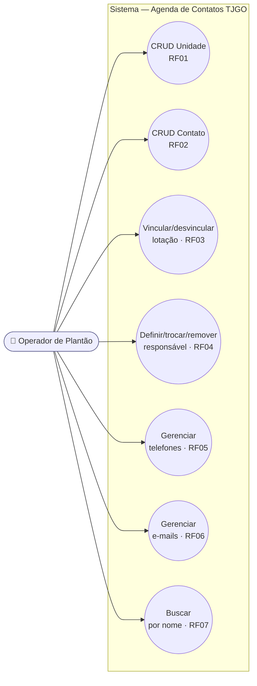

> [!info] Onde isto se encaixa
> Etapa **1 — Levantamento de requisitos**. Esta spec cobre a aplicação **console**. Modelo de dados em [v0.1-data-model](v0.1-data-model.md), estrutura de classes em [v0.1-classes](v0.1-classes.md). Visão geral em [README](README.md).

# Visão de uma frase

> Quando o **operador de plantão** precisa falar com uma unidade prisional ou órgão, ele quer **achar rápido o telefone/e-mail certo** (da unidade ou da pessoa responsável) num cadastro estruturado, em vez de caçar em planilha e WhatsApp.

# Ator

- **Operador de plantão** (servidor TJGO, uso interno) — único ator, sem autenticação.

# User stories

| ID | Como operador, quero… | …para |
|----|-----------------------|-------|
| US01 | cadastrar/editar/remover **unidades** | manter o catálogo de órgãos e unidades prisionais |
| US02 | cadastrar/editar/remover **contatos** (pessoas) | manter as pessoas ligadas às unidades |
| US03 | **vincular/desvincular** um contato às unidades onde é lotado (uma pessoa pode estar em várias) | refletir onde cada pessoa trabalha |
| US04 | **definir/trocar/remover** o responsável de uma unidade | saber a quem recorrer por aquela unidade |
| US05 | **adicionar/listar/remover telefones** de uma unidade ou de um contato | registrar os vários números (plantão, celular, fixo) |
| US06 | **adicionar/listar/remover e-mails** de uma unidade ou de um contato | registrar os vários e-mails |
| US07 | **buscar por nome** (unidade ou pessoa) | localizar rápido durante o plantão |
| US08 | receber **mensagens claras de erro** ao errar uma operação | não quebrar o sistema nem perder dados |

# Requisitos funcionais

| RF | Descrição | Story |
|----|-----------|-------|
| **RF01** | CRUD de **Unidade** (id, nome, tipo, endereço, responsável, criado_em) | US01 |
| **RF02** | CRUD de **Contato** (id, nome, cargo, unidade de lotação, criado_em) | US02 |
| **RF03** | **Vincular/desvincular lotação** (contato ↔ unidade, **N:N** via tabela `lotacao`) | US03 |
| **RF04** | **Definir / trocar / remover responsável** da unidade (`responsavel_id`) | US04 |
| **RF05** | **Gerenciar telefones** (adicionar / listar / remover) de unidade **e** de contato | US05 |
| **RF06** | **Gerenciar e-mails** (adicionar / listar / remover) de unidade **e** de contato | US06 |
| **RF07** | **Busca por nome** — `ILIKE '%termo%'` em unidades **e** contatos | US07 |
| **RF08** | **Tratamento de exceções** — registro inexistente, violação de FK/CHECK, entrada inválida | US08 (transversal) |

# Requisitos não funcionais

| RNF | Descrição | Verificação |
|-----|-----------|-------------|
| **RNF01 — Portabilidade de setup** | Roda em máquina limpa sem dependência além do PostgreSQL; Maven resolve o driver | `git clone` → `mvn` → run, sem ajuste manual |
| **RNF02 — Dump executável** | `dump.sql` roda de primeira em banco vazio (F5 sem erro) | `psql -f dump.sql` em DB novo retorna 0 |
| **RNF03 — Integridade no banco** | NOT NULL, FK, CHECK (inclusive arco exclusivo) garantidos pelo SGBD, não só pela app | constraints presentes no DDL |
| **RNF04 — Tecnologia adotada** | Java 17+, JDBC puro, PostgreSQL 18, build Maven | ver [ADR-001-stack](ADR-001-stack.md) |
| **RNF05 — Operação por console** | Interface = menu de texto; sem GUI | `app.MenuConsole` |
| **RNF06 — Documentação reproduzível** | README permite outro dev rodar em ~15 min | passo-a-passo testado em máquina limpa |

# Regras de negócio

- **RN01** — Telefone e e-mail pertencem a **exatamente um** dono (unidade *ou* contato) — arco exclusivo garantido por CHECK.
- **RN02** — Uma unidade é **contactável de forma autônoma**: pode ter telefones/e-mails e **zero** contatos.
- **RN03** — Lotação é **N:N**: um contato pode estar lotado em **0..N** unidades; uma unidade tem **0..N** contatos (via tabela associativa `lotacao`). Um mesmo vínculo não se duplica (PK composta).
- **RN04** — Uma unidade tem **0..1** responsável; um contato pode ser responsável por **0..N** unidades.
- **RN05** — O responsável **não precisa** estar lotado na mesma unidade (lotação e responsabilidade são relações independentes).
- **RN06** — Ao excluir um contato que é responsável por unidades, o vínculo de responsável é zerado (`SET NULL`), não bloqueia a exclusão.
- **RN07** — Ao excluir uma unidade, os vínculos de lotação somem (`CASCADE`) mas os contatos sobrevivem; os telefones/e-mails **da própria unidade** são removidos (`CASCADE`). Idem ao excluir contato.
- **RN08** — Telefone é armazenado como **só dígitos com DDI** (ex.: `5562999999999`), validado por `CHECK (numero ~ '^[0-9]{8,15}$')`. **DDI 55 (Brasil)** é default na entrada; a máscara/formatação é responsabilidade da apresentação (suporta número internacional).

# Critérios de aceite (binários)

- [ ] **CA01** — Criar, listar, editar e remover uma unidade funciona ponta a ponta.
- [ ] **CA02** — Criar, listar, editar e remover um contato funciona ponta a ponta.
- [ ] **CA03 (chave)** — É possível cadastrar uma unidade com telefones/e-mails e **ZERO contatos**, e essa unidade **aparece nas listagens e buscas normalmente**.
- [ ] **CA04** — Vincular o **mesmo contato a duas unidades** e depois desvincular de uma reflete corretamente (lotação N:N); o vínculo duplicado é rejeitado pela PK composta.
- [ ] **CA05** — Definir, trocar e remover o responsável de uma unidade funciona; o mesmo contato pode ser responsável por mais de uma unidade.
- [ ] **CA06** — Uma unidade pode ter ≥ 2 telefones e ≥ 2 e-mails; um contato também.
- [ ] **CA07** — Tentar inserir telefone/e-mail sem dono **ou** com dois donos é **rejeitado** pelo CHECK (mensagem clara, não stack trace cru).
- [ ] **CA08** — Buscar por um trecho de nome retorna tanto unidades quanto contatos correspondentes.
- [ ] **CA09** — Operar sobre um id inexistente retorna mensagem amigável, sem encerrar o programa.

# Diagrama de casos de uso

> [!note] RF08 é transversal
> O tratamento de exceções (registro inexistente, FK, CHECK, entrada inválida) não é um caso de uso isolado — é critério de aceite (CA07, CA09) presente em **todos** os fluxos acima.
